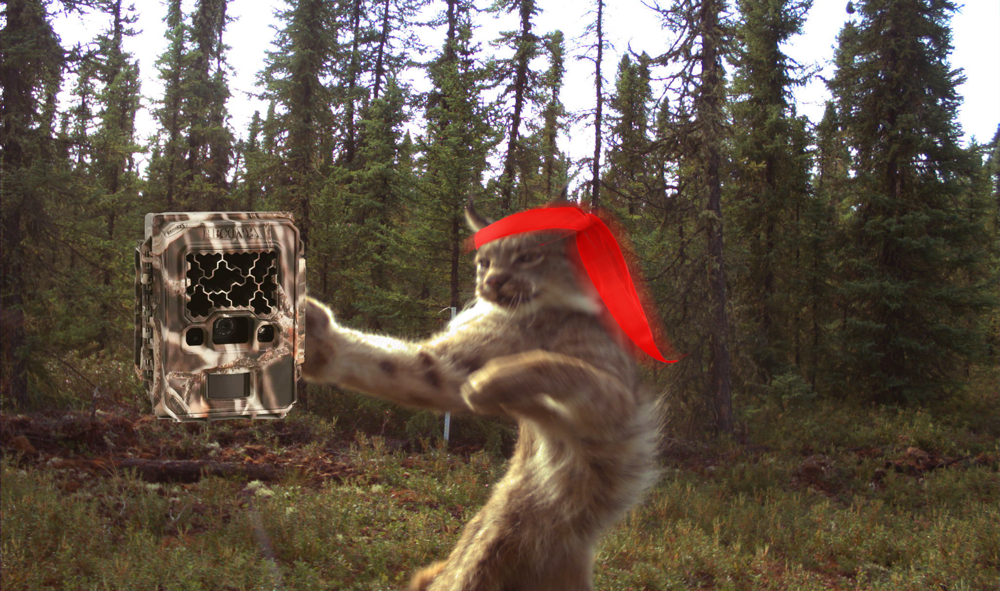

--- 
title: "An Primer to Camera Trap Data Management and Analysis in R"
author: "Christopher Beirne, the Wildlife Coexistence Lab, UBC, and the WildCam Network"
date: "`r Sys.Date()`"
site: bookdown::bookdown_site
output: bookdown::gitbook
documentclass: book
bibliography: [book.bib, packages.bib]
toc-title: "Contents"
biblio-style: apalike
link-citations: yes
github-repo: "ChrisBeirne/One_day_primer_to_cameratrap_data_analysis"
description: "One day primer forcamera trap data management and analysis course"
---

# Introduction

```{r ch0_1, echo=F, message=F, warning=F}
library(bookdown)

```

**This is an abridged version of the full three day course located here:** 

[An Introduction to Camera Trap Data Management and Analysis in R](https://wildcolab.github.io/Introduction-to-Camera-Trap-Data-Management-and-Analysis-in-R/). 

That version will be the most up-to-date and comprehensive.  

## How to use this book

You can run this code to get a quick flavour for camera trap data analyses and work flows. 

- [Download the example data via dropbox](https://www.dropbox.com/sh/fpnsinyn1ml9x28/AAB-Y-glHHRDsiCdmQnVLx7Wa?dl=0) and 'follow-along' by cutting and pasting the code

**Important note** The code chunks are color coded by their function:

```{r, class.source="Rmain"}
# Green chunks are essential code which must be copied and run in 
# R for the document to work
```

When you hover over these colored chunks a 'copy' symbol will appear in the top right to transfer your code!

```{r ch0_3, echo=F}
print("Gray code chucks are code output from R")
```

## Get in touch

If you have any questions about this document and the information it contains, please [email me](c.w.beirne@gmail.com) or, better still, submit an issue on our [the course GitHub page](https://github.com/ChrisBeirne/One_day_primer_to_cameratrap_data_analysis). 

## Cite the course

If you would like to cite this primer, please use the citation for the full course:

Beirne, C. & Burton, C. (2022). An Introduction to Camera Trap Data Management and Analysis in R https://zenodo.org/doi/10.5281/zenodo.10524184


## Acknowledgements

This course was produced by [Christopher Beirne](https://www.researchgate.net/profile/Christopher-Beirne), Cole Burton's [Wildlife Coexistence Lab at UBC](https://wildlife.forestry.ubc.ca/), and [the WildCAM Network](https://wildcams.ca/). 
